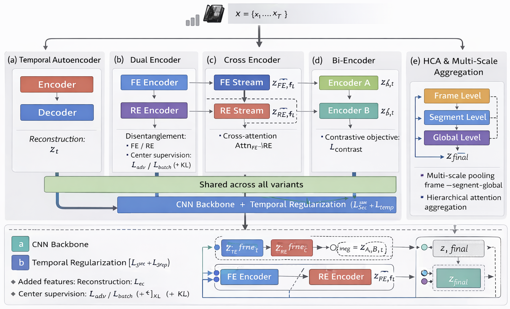

# Disentangling Clinic-Specific Acquisition Variability from Motion Dynamics in Intrapartum Ultrasound


---

## Overview

This repository contains the official implementation of our self-supervised representation learning framework for multi-centre intrapartum ultrasound harmonization. The framework disentangles centre-induced temporal distortions from physiologically meaningful motion dynamics without manual annotations.

<p align="center">
  
</p>

**Figure 2.** Overview of the five progressive architectures. **(a)** Temporal Autoencoder establishes the baseline with temporal regularization (L_scale + L_spec). **(b)** Dual Encoder adds explicit disentanglement into centre-invariant (FE) and centre-specific (RE) streams via adversarial training. **(c)** Cross Encoder introduces bidirectional cross-attention between FE and RE streams. **(d)** Bi-Encoder adopts a contrastive learning objective for temporal consistency. **(e)** HCA Encoder incorporates 3-level hierarchical multi-scale aggregation (frame → segment → global). All architectures share the same CNN backbone and temporal regularization foundation (blue bar).

---

## Results

### Table 1 — Progressive Architecture Comparison (TOP)

| Architecture | TOP Acc. (%) | 95% CI | Key Mechanism |
|---|---|---|---|
| Temporal AE | 95.51 | [93.30, 97.50] | Scale + spectral regularization |
| Dual Encoder | 94.41 | [93.85, 98.60] | FE/RE adversarial decomposition |
| Cross Encoder | 98.04 | [96.93, 99.44] | Bidirectional cross-attention |
| Bi-Encoder | 91.62 | [88.83, 94.69] | Contrastive temporal learning |
| **HCA Encoder** | **99.70** | **[99.10, 100.0]** | 3-level hierarchical aggregation |

### Table 2 — Leave-One-Center-Out (LOCO) Validation

| Test Center | HCA Acc. (%) | Temporal AE Acc. (%) | Δ (%) |
|---|---|---|---|
| Center 2 | **98.6** | 94.2 | +4.4 |
| Center 6 | **97.4** | 92.1 | +5.3 |
| Center 8 | **99.1** | 95.0 | +4.1 |
| Mean | **98.4** | 93.8 | +4.6 |

### Table 4 — Comparison with Existing Methods

| Method | TOP Acc. (%) | ASW (FE) | Training |
|---|---|---|---|
| Raw (no training) | 47.3 ± 0.0 | 0.40 | – |
| ComBat + Autoencoder | 88.6 ± 2.0 | 0.30 | Fast |
| DANN | 92.3 ± 1.6 | 0.31 | Slow |
| Temporal AE (ours) | 95.5 ± 1.1 | 0.25 | Fast |
| **HCA (ours)** | **99.3 ± 0.4** | **0.24** | Moderate |

---

## Repository Structure

```
MICCAI_INTRAPARTUM/
│
├── README.md
├── requirements.txt
├── .gitignore
│
├── encoders/
│   ├── __init__.py
│   ├── autoencoder.py                     # (a) Temporal Autoencoder
│   ├── dual_encoder.py                    # (b) Dual Encoder — FE/RE disentanglement
│   ├── cross_encoder.py                   # (c) Cross Encoder — bidirectional attention
│   ├── bi_encoder.py                      # (d) Bi-Encoder — contrastive learning
│   └── hca_encoder.py                     # (e) HCA Encoder — full model
│
├── evaluation/
│   ├── __init__.py
│   ├── loco.py                            # Table 2 — Leave-one-center-out
│   ├── incremental_component_analysis.py  # Table 3 — Component contribution
│   ├── baseline_comparison.py             # Table 4 — vs. ComBat, DANN
│   └── hc18_segmentation.py               # Table 5 — HC18 transfer & noise robustness
│
├── assets/
│   └── framework.png                      # Fig. 2 — Architecture overview
│
├── weights/
│   └── .gitkeep
│
└── data/
    └── .gitkeep
```

---

## Installation

```bash
git clone https://github.com/anonymous/miccai-intrapartum.git
cd miccai-intrapartum
pip install -r requirements.txt
```

**Python 3.9+ required.**

---

## Dataset Setup

We collected **360 video clips** from three clinical centres with heterogeneous acquisition protocols (stratified 70/15/15 subject-level split).

Place your data under `data/preprocessed/` following this structure:

```
data/
└── preprocessed/
    ├── A_fixed/
    │   ├── Merkez 2/
    │   │   └── <subject>/
    │   │       ├── <clip>.npy           # (T, H, W) uint8 — raw grayscale frames
    │   │       └── <clip>_valid.npy     # (T,) bool — frame quality mask
    │   ├── Merkez 6/
    │   └── Merkez 8/
    └── B_variable/
        └── ...
```

> **Note:** Patient data cannot be shared publicly due to ethical constraints (Ethics Committee Protocol No: 2025/408, Date: 19.12.2025). The dataset structure and loading pipeline are provided for reproducibility with your own data.

---

## Training

All encoders share the same CNN backbone, temporal regularization, and training hyperparameters. Only the architectural mechanism and active loss terms differ.

```bash
# (a) Temporal Autoencoder — baseline
python encoders/autoencoder.py

# (b) Dual Encoder — FE/RE disentanglement
python encoders/dual_encoder.py

# (c) Cross Encoder — bidirectional cross-attention
python encoders/cross_encoder.py

# (d) Bi-Encoder — contrastive temporal learning
python encoders/bi_encoder.py

# (e) HCA Encoder — full model
python encoders/hca_encoder.py
```

Each script runs the full pipeline: metadata creation → subject-level split → training with validation → best model checkpoint → TOP evaluation on the held-out test set. Trained weights are saved to `weights/` automatically.

---

## Evaluation

Each script loads trained weights from `weights/` and evaluates on the held-out test set. Results are printed to terminal and saved as `.csv` + plots.

```bash
# Table 2 — Leave-One-Center-Out validation
python evaluation/loco.py

# Table 3 — Incremental component contribution (TOP Acc + ASW)
python evaluation/incremental_component_analysis.py

# Table 4 — Comparison with ComBat and DANN
python evaluation/baseline_comparison.py

# Table 5 — HC18 segmentation transfer + noise robustness
python evaluation/hc18_segmentation.py
```

---

## Key Hyperparameters

All models trained with identical settings:

| Parameter | Value |
|---|---|
| Image size | 128 × 128 |
| Temporal window (T) | 64 frames |
| Latent dimension | 128 |
| Batch size | 4 |
| Epochs | 10 |
| Learning rate | 2e-4 |
| Train / Val / Test | 70 / 15 / 15 (subject-level) |
| HCA segments | 4 × 16 frames |
| Bootstrap iterations | 1000 |
| Permutation iterations | 500 |


---

## License

This project is released under the MIT License.